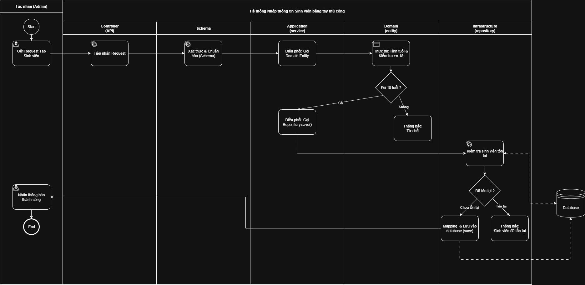
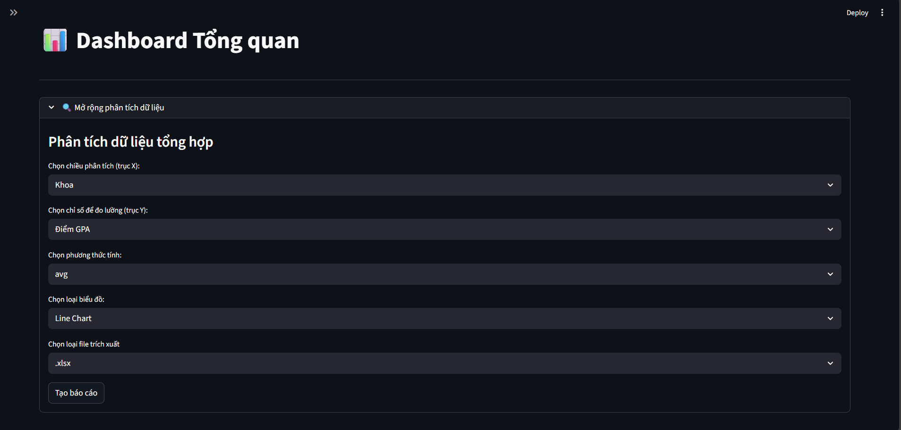
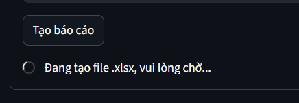
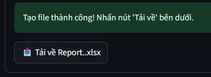
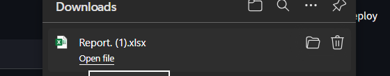
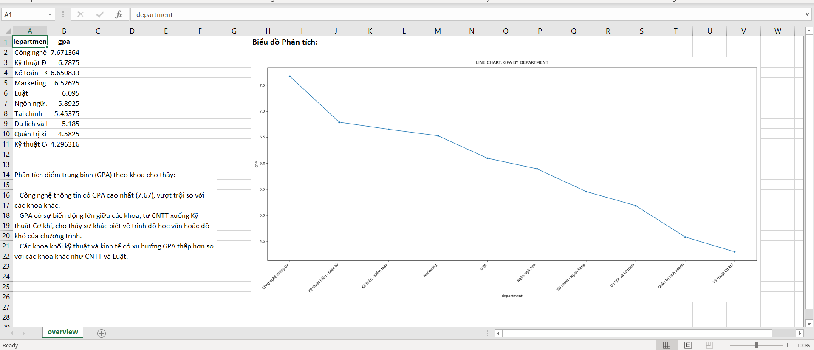

# 🎓 Hệ thống Quản lý & Phân tích Sinh viên (Student Management & Analytics System)


## 📖 Giới thiệu
Đây là dự án backend quản lý sinh viên được xây dựng dựa trên kiến trúc **Domain-Driven Design (DDD)** và **Clean Architecture**.

Hệ thống không chỉ dừng lại ở việc quản lý thông tin (CRUD) mà còn tích hợp quy trình **Tự động hóa Báo cáo (Automated Reporting Workflow)**. Hệ thống có khả năng tự động vẽ biểu đồ, phân tích dữ liệu và sinh ra nhận xét (insight) bằng trí tuệ nhân tạo (Google Gemini), tất cả được xử lý song song để tối ưu hiệu năng.

## 🚀 Công nghệ sử dụng

* **Core:** Python 3.10+
* **Framework:** FastAPI (Asynchronous Web Framework)
* **Data Analysis:** Pandas, Numpy
* **Visualization:** Seaborn, Matplotlib (xử lý đa luồng tránh blocking)
* **AI Integration:** Google Gemini API (Generative AI)
* **Architecture:** Layered Architecture (UI -> Controller -> Schema -> Application -> Infrastructure)

## ✨ Tính năng nổi bật

### 1. 🛡️ Quản lý Sinh viên (Core Domain)
* ✅ Tạo mới sinh viên với validation chặt chẽ (kiểm tra tuổi >= 18).
* ✅ Tìm kiếm, cập nhật và xóa thông tin sinh viên.
* ✅ Kiểm tra logic nghiệp vụ nghiêm ngặt tại Domain Layer.

> **Luồng nghiệp vụ (Business Process):**
>
> 

### 2. 📥 Nhập liệu từ File (Smart Import)
* ✅ **Hỗ trợ định dạng .docx:** Cho phép thêm hàng loạt sinh viên từ file Word thay vì nhập tay từng người.
* ✅ **Trích xuất thông minh:** Tự động đọc dữ liệu từ bảng (Table) trong file văn bản bằng `python-docx`.
* ✅ **Validation hàng loạt:** Hệ thống tự động kiểm tra tính hợp lệ (Tuổi >= 18, Email duy nhất) cho từng bản ghi trong file.
    * *Nếu dòng nào lỗi:* Báo lỗi cụ thể để người dùng sửa.
    * *Nếu hợp lệ:* Lưu vào cơ sở dữ liệu.

> **Minh họa quy trình Import:**
>
> .drawio.png)

### 3. 📊 Báo cáo & Phân tích Tự động (Advanced)
Quy trình tạo báo cáo được điều phối tự động (**Orchestration**):
* **Query:** Tự động phát hiện bảng và truy vấn dữ liệu theo cột động.
* **Visualization:** Vẽ biểu đồ (Bar, Line, Pie...) dựa trên dữ liệu truy vấn.
* **AI Insight:** Sử dụng Google Gemini để đọc dữ liệu và đưa ra nhận xét, dự báo xu hướng.
* **Performance:** Tác vụ Vẽ biểu đồ và AI Insight chạy **song song (Async Parallel)** giúp giảm **50%** thời gian chờ.
* **Export:** Xuất kết quả ra các định dạng file (`Excel`, `PDF`, `CSV`...) kèm biểu đồ và nhận xét.

> **Sơ đồ Orchestration (Xử lý song song):**
>
> 

## 🛠️ Cấu trúc Dự án (DDD)

```
doAnCuoiKhoa/
├── .env                   # Biến môi trường (DB, API Key)
├── requirements.txt       # Danh sách thư viện
├── venv/                  # Môi trường ảo
└── src/                   # Mã nguồn chính
    ├── application/       # Application Services (Nhạc trưởng điều phối)
    ├── domain/            # Domain Layer (Entities, Repositories Interface, small service)
    ├── infrastructure/    # Triển khai kỹ thuật (DB, External Services)
    ├── presentation/      # Giao diện người dùng
    │   ├── api/           # FastAPI Controllers
    │   └── ui/            # Streamlit Frontend (Home.py)
    ├── config/            # Cấu hình hệ thống
    └── utils/             # Các tiện ích chung
```

# ⚙️ Yêu cầu hệ thống

1. Python: Phiên bản 3.10 trở lên.

2. PostgreSQL: Đã cài đặt và đang chạy.

# 📥 Hướng dẫn Cài đặt

## Bước 1: Clone dự án

   git clone <link-git-cua-ban>
   cd Manage-student

## Bước 2: Tạo môi trường ảo (Venv)
   Khuyến nghị sử dụng môi trường ảo để tránh xung đột thư viện.

   ### Linux/macOS
   python3 -m venv venv
   source venv/bin/activate

   ### Windows
   python -m venv venv
   .\venv\Scripts\activate

## Bước 3: Cài đặt thư viện

   pip install -r requirements.txt

# ▶️ Hướng dẫn Khởi chạy (Chạy song song)
   Hệ thống yêu cầu chạy 2 tiến trình riêng biệt. Bạn cần mở 2 cửa sổ Terminal (đều phải kích hoạt venv trước khi chạy).

   ## 🟢 Terminal 1: Khởi chạy Backend (FastAPI)
      API Service chịu trách nhiệm xử lý logic và kết nối Database.

      ### Linux/macOS (Lưu ý: export PYTHONPATH để nhận diện thư mục src)
      source venv/bin/activate
      export PYTHONPATH=$PYTHONPATH:.
      python3 -m uvicorn src.presentation.api.main:app --reload --host 0.0.0.0 --port 8000

      ### Windows
      .\venv\Scripts\activate
      python -m uvicorn src.presentation.api.main:app --reload --host 0.0.0.0 --port 8000

   ## 🔴 Terminal 2: Khởi chạy Frontend (Streamlit)
      Giao diện người dùng để tương tác với hệ thống.

      # Linux/macOS
      source venv/bin/activate
      export PYTHONPATH=$PYTHONPATH:.
      python3 -m streamlit run src/presentation/ui/Home.py --server.port 8501

      # Windows
      .\venv\Scripts\activate
      python -m streamlit run src/presentation/ui/Home.py --server.port 8501

   >Truy cập Web App: http://localhost:8501

# 🎬 Kịch bản Demo: Tự động hóa Phân tích & Báo cáo Thông minh
   Thưa thầy/cô, trong quản lý sinh viên truyền thống, việc tạo ra một báo cáo tổng hợp thường mất nhiều thời gian: Người quản lý phải truy vấn DB, copy sang Excel để vẽ biểu đồ, rồi tự nhìn số liệu để viết nhận xét. Quy trình này rời rạc và tốn kém nhân lực.

   >👉 Giải pháp: "Hệ thống của em tích hợp quy trình Orchestration Workflow, cho phép tạo báo cáo trọn gói chỉ với 1 cú click, kết hợp sức mạnh của Generative AI."

   ## 🟢 Bước 1: Cấu hình Báo cáo (Input Configuration)
   **Hành động:** Mở trang Analytics trên giao diện Streamlit.

   >

   **Thao tác:**

   * **Chọn tiêu chí thống kê:** Theo Khoa (Department).

   * **Chọn chỉ số:** Điểm (GPA).

   * **Chọn loại tính toán:** Trung Bình (avg)

   * **Chọn loại biểu đồ:** Bar Chart.

   * **Chọn loại file trích xuất:** File Excel (.xlsx)

   **Lời thoại:**

   >"Đầu tiên, admin có thể tùy chỉnh báo cáo theo nhu cầu động. Tại đây, hệ thống sử dụng Pydantic Schema để validate dữ liệu đầu vào ngay lập tức, đảm bảo yêu cầu gửi xuống Backend là hợp lệ."

   ## 🟡 Bước 2: Xử lý Song song (The Technical Highlight) - Quan trọng nhất
   **Hành động:** Nhấn nút "Tạo báo cáo".

   >

   **Thao tác:** (Nếu có thể, hãy bật cửa sổ Terminal bên cạnh để show log đang chạy).

   **Lời thoại:**

   >"Khi em nhấn nút này, Backend không xử lý tuần tự. Application Layer đóng vai trò 'Nhạc trưởng' (Orchestrator), kích hoạt cơ chế Asynchronous Parallel Processing (Bất đồng bộ song song).

   **Cụ thể:**

   * Tác vụ Vẽ biểu đồ (sử dụng Seaborn/Matplotlib) đang chạy trên một luồng.

   * Cùng lúc đó, AI Agent (Google Gemini) được gọi để phân tích dữ liệu thô.

   * 👉 Kỹ thuật này giúp giảm 50% độ trễ (latency) so với việc chạy tuần tự.

   ## 🟣 Bước 3: Xuất file Báo cáo (Export Strategy)
   **Hành động:**

   * Nhấn Download.
   >
   
   * Mở file vừa tải về lên.
   >

   **Thao tác:** Show file Excel có chứa cả: Bảng số liệu + Hình ảnh biểu đồ + Lời nhận xét của AI.

   **Lời thoại:**

   >"Cuối cùng, hệ thống đóng gói toàn bộ kết quả (Data, Chart, Insight) vào một file excel chuẩn định dạng bằng thư viện pandas. Admin có thể dùng file này để trình lên cấp trên ngay lập tức mà không cần chỉnh sửa gì thêm."

   ## Result:

   >

## 🌐 Link Demo & Triển khai (Deployment)

Dưới đây là đường dẫn truy cập hệ thống đã được triển khai thực tế trên môi trường Cloud:

| Thành phần | Đường dẫn truy cập | Ghi chú |
| :--- | :--- | :--- |
| **Frontend (Web App)** | 👉 [**https://manage-student-nhuthao.streamlit.app**](https://manage-student-nhuthao.streamlit.app) | **Giao diện chính.** Dành cho người dùng cuối. |
| **Backend (API Docs)** | 👉 [**https://manage-student-23ps.onrender.com/docs**](https://manage-student-23ps.onrender.com/docs) | Tài liệu kỹ thuật API (Swagger UI). |
| **Source Code** | 👉 [**Link GitHub của bạn**](https://github.com/FULLSTACKI/Manage-student) | Kho mã nguồn dự án. |

> [!WARNING]
> **⚠️ Lưu ý quan trọng về Server Miễn phí:**
> Do dự án sử dụng gói **Render Free Tier** và **Streamlit Cloud**, hệ thống sẽ tự động "ngủ đông" sau 15 phút không hoạt động.
> * **Hiện tượng:** Lần truy cập đầu tiên có thể mất khoảng **50 giây - 1 phút** để Server khởi động lại.
> * **Khắc phục:** Nếu thấy web load lâu, xin thầy/cô vui lòng kiên nhẫn chờ một chút, các lần truy cập sau sẽ nhanh bình thường.
> * **Đối với Streamlit:** Nếu thấy màn hình thông báo *"This app is in the oven"* hoặc *"Sleeping"*, vui lòng bấm nút **"Yes, get this app back up"**.

# 👨‍💻 Tác giả
* **Trần Như Thao**
* **Email: tranthicuc03032017@gmail.com**
* **Dự án cuối khóa.**